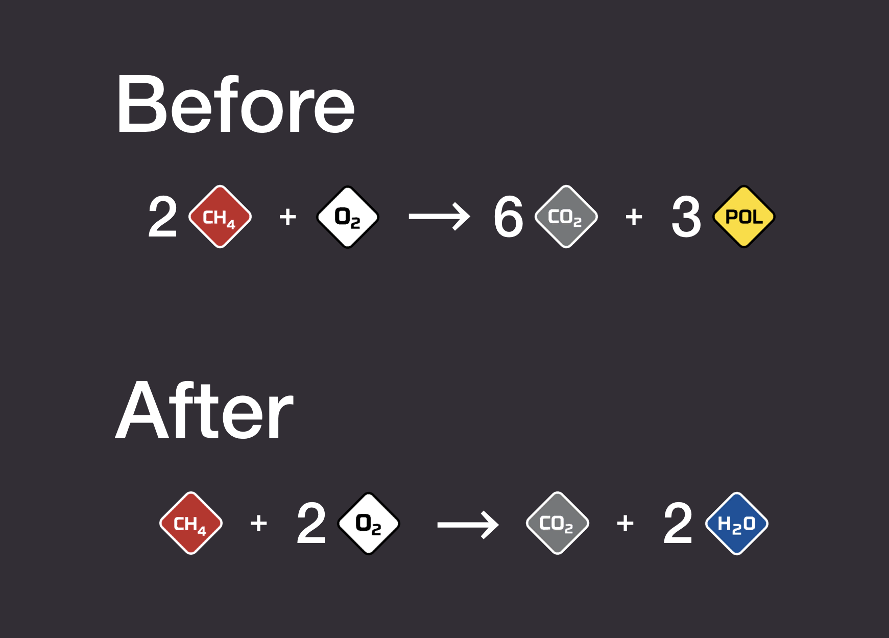

# Stationeers Combustion Fix

Replaces the incorrect methane combustion reaction `2 CH4 + O2 → 6 CO2 + 3 POL` with the chemically correct reaction `CH4 + 2 O2 → CO2 + 2 H2O`.



The plugin patches fields in `Combustion.ResultMethaneOxygen` to ensure chemically accurate methane combustion outputs.

If welding releases methane into the atmosphere, make sure the oxygen proportion in the fuel mixture is at least twice the methane proportion. A mixture of 33% methane and 67% oxygen should work.

## Requirements

This mod is a BepInEx plugin. It requires BepInEx with the [StationeersLaunchPad](https://github.com/StationeersLaunchPad/StationeersLaunchPad) plugin to be installed. See the StationeersLaunchPad repository for the detailed install guide.

BepInEx only loads plugins from its own `BepInEx/plugins` folder, while subscribed Workshop mods live in Steam's workshop content folder. StationeersLaunchPad is the loader that bridges the two: it discovers the subscribed mod and hands its assembly to BepInEx. Without a loader, a subscribed-only mod is downloaded but never loaded.

## Installing the Mod (for Developers)

Before building, make sure there are no conflicting copies of the mod:

1. Unsubscribe from the mod in Steam Workshop (if subscribed).
2. Verify there is no `StationeersCombustionFix.dll` in `<GameDir>\BepInEx\plugins\` (where `<GameDir>` is your Stationeers installation path, e.g. `C:\Program Files (x86)\Steam\steamapps\common\Stationeers`).

Then run the build script:

```powershell
.\Build-Plugin.ps1
```

This builds the plugin in Release configuration and deploys it (along with the `About` folder) to `Documents\My Games\Stationeers\mods\StationeersCombustionFix\`.

Launch the game. StationeersLaunchPad will pick up the mod automatically.

## Installing the Mod (for Players)

1. Install BepInEx with the StationeersLaunchPad plugin (see the [StationeersLaunchPad](https://github.com/StationeersLaunchPad/StationeersLaunchPad) guide).
2. Subscribe to the mod on the Steam Workshop.
3. Launch the game. StationeersLaunchPad loads the mod automatically; enable it in the loader window at the bottom of the loading screen if needed.

Alternatively, without a loader, install BepInEx and copy `StationeersCombustionFix.dll` into `BepInEx/plugins` manually.

## Configuration

The mod exposes one BepInEx setting (section `General`):

* `PatchMethaneOzoneReaction` (default `false`): when enabled, also patches the methane + ozone combustion reaction. The methane + oxygen patch is always applied. You can toggle this in the StationeersLaunchPad configuration window at startup, or by editing the generated `BepInEx/config/StationeersCombustionFix.cfg` file.

## Setting Up the Project

The project requires a reference to `Assembly-CSharp.dll` from your local Stationeers installation. This file is not included in the repository.

Running unit tests additionally requires `UnityEngine.dll` and `UnityEngine.CoreModule.dll` from your local Stationeers installation.

1. Copy `Directory.Build.props.example` to `Directory.Build.props` (in the repository root):
   ```
   cp Directory.Build.props.example Directory.Build.props
   ```
2. Open `Directory.Build.props` and set `GameDir` to your Stationeers installation path:
   * **Windows:** `c:\Program Files (x86)\Steam\steamapps\common\Stationeers`
   * **macOS:** `/Users/yaskovdev/Library/Application Support/Steam/steamapps/common/Stationeers`

   `Directory.Build.props` is ignored in Git, so this change stays local to your machine.
3. Run `dotnet clean` and `dotnet build` to build the project.

## Publishing to Steam Workshop

1. Create the `$env:USERPROFILE\Documents\My Games\Stationeers\mods\StationeersCombustionFix` folder.
2. Create an empty `GameData` folder in the new folder.
3. Copy the `About` folder to the new folder.
4. Copy the `StationeersCombustionFix.dll` to the new folder.
5. Run Stationeers, then go to Workshop. You'll see the mod and the Publish button.
