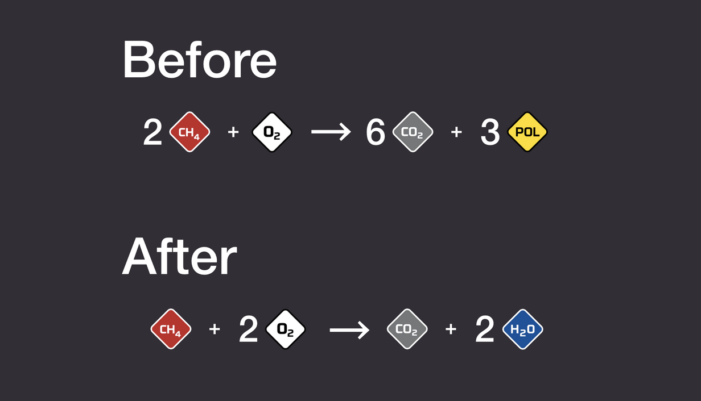

# Stationeers Combustion Fix

Fixes incorrect methane combustion reactions to be chemically accurate.



## Methane + Oxygen

Replaces the incorrect reaction `2 CH₄ + O₂ → 6 CO₂ + 3 Pol` with the correct reaction `CH₄ + 2 O₂ → CO₂ + 2 H₂O`.

Recommended fuel mixture: 33% methane, 67% oxygen.

Always enabled.

## Methane + Nitrous Oxide

Replaces the incorrect reaction `CH₄ + N₂O → 2 CO₂ + 2 N₂` with the correct reaction `CH₄ + 4 N₂O → CO₂ + 2 H₂O + 4 N₂`.

Recommended fuel mixture: 20% methane, 80% nitrous oxide.

Disabled by default. Enable in the StationeersLaunchPad configuration window or in `<GameDir>\BepInEx\config\StationeersCombustionFix.cfg` (where `<GameDir>` is the game folder, e.g. `C:\Program Files (x86)\Steam\steamapps\common\Stationeers`).

## Methane + Ozone

Replaces the incorrect reaction `3 CH₄ + 2 O₃ → 6 CO₂ + 3 Pol + H₂O` with the correct reaction `3 CH₄ + 4 O₃ → 3 CO₂ + 6 H₂O`.

Recommended fuel mixture: 42% methane, 58% ozone.

Disabled by default. Enable in the StationeersLaunchPad configuration window or in `<GameDir>\BepInEx\config\StationeersCombustionFix.cfg` (where `<GameDir>` is the game folder, e.g. `C:\Program Files (x86)\Steam\steamapps\common\Stationeers`).

## Notes

* The mod does not modify save files, so it can be safely enabled or disabled at any time.
* Avoids the issue of leftover methane in the welder.
* Tested with the Gas Fuel Generator (GFG). Combustion reaches the expected 90% ratio.

## Requirements

This mod is a BepInEx plugin. It requires BepInEx with the [StationeersLaunchPad](https://github.com/StationeersLaunchPad/StationeersLaunchPad) plugin to be installed. See the StationeersLaunchPad repository for the detailed install guide.

BepInEx only loads plugins from its own `BepInEx/plugins` folder, while subscribed Workshop mods live in Steam's workshop content folder. StationeersLaunchPad is the loader that bridges the two: it discovers the subscribed mod and hands its assembly to BepInEx. Without a loader, a subscribed-only mod is downloaded but never loaded.

## Installing the Mod (for Developers)

Before building, make sure there are no conflicting copies of the mod:

1. Unsubscribe from the mod in Steam Workshop (if subscribed).
2. Verify there is no `StationeersCombustionFix.dll` in `<GameDir>\BepInEx\plugins\` (where `<GameDir>` is your Stationeers installation path, e.g. `C:\Program Files (x86)\Steam\steamapps\common\Stationeers`).

Then run the build script:

```powershell
.\Build-Plugin.ps1
```

This builds the plugin in Release configuration and deploys it (along with the `About` folder) to `Documents\My Games\Stationeers\mods\StationeersCombustionFix\`.

Launch the game. StationeersLaunchPad will pick up the mod automatically.

## Installing the Mod (for Players)

1. Install BepInEx with the StationeersLaunchPad plugin (see the [StationeersLaunchPad](https://github.com/StationeersLaunchPad/StationeersLaunchPad) guide).
2. Subscribe to the mod on the Steam Workshop.
3. Launch the game. StationeersLaunchPad loads the mod automatically; enable it in the loader window at the bottom of the loading screen if needed.

Alternatively, without a loader, install BepInEx and copy `StationeersCombustionFix.dll` into `BepInEx/plugins` manually.

## Configuration

The mod exposes the following BepInEx settings (section `General`):

* `PatchMethaneNitrousReaction` (default `false`): when enabled, also patches the methane + nitrous oxide combustion reaction.
* `PatchMethaneOzoneReaction` (default `false`): when enabled, also patches the methane + ozone combustion reaction.

The methane + oxygen patch is always applied. You can toggle the optional patches in the StationeersLaunchPad configuration window at startup, or by editing the generated `<GameDir>\BepInEx\config\StationeersCombustionFix.cfg` file.

## Setting Up the Project

The project requires a reference to `Assembly-CSharp.dll` from your local Stationeers installation. This file is not included in the repository.

Running unit tests additionally requires `UnityEngine.dll` and `UnityEngine.CoreModule.dll` from your local Stationeers installation.

1. Copy `Directory.Build.props.example` to `Directory.Build.props` (in the repository root):
   ```
   cp Directory.Build.props.example Directory.Build.props
   ```
2. Open `Directory.Build.props` and set `GameDir` to your Stationeers installation path:
   * **Windows:** `c:\Program Files (x86)\Steam\steamapps\common\Stationeers`
   * **macOS:** `/Users/yaskovdev/Library/Application Support/Steam/steamapps/common/Stationeers`

   `Directory.Build.props` is ignored in Git, so this change stays local to your machine.
3. Run `dotnet clean` and `dotnet build` to build the project.

## Publishing to Steam Workshop

The same steps apply for both the initial publish and subsequent updates.

1. Run `.\Build-Plugin.ps1` to build and deploy the mod locally.
2. Launch Stationeers, then go to Workshop. You'll see the mod and the Publish/Update button.
